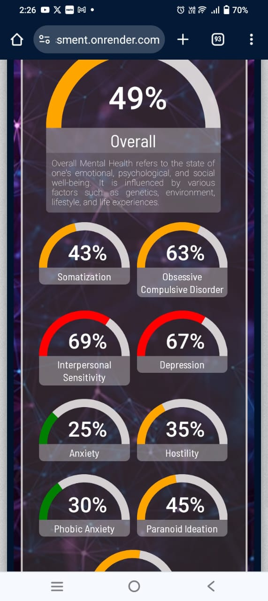

# Mental Health Prediction System

## Introduction
This project, titled "Mental Health Prediction System," is a minor project undertaken by three students pursuing their Bachelor of Technology (B.Tech) in Computer Science and Engineering at Guru Nanak Dev Engineering College, Ludhiana. The project aims to develop a system that predicts mental health conditions based on various input parameters.

## Project Description
Mental health is a crucial aspect of overall well-being, and early detection of potential mental health issues can significantly improve outcomes for individuals. Our project focuses on creating a predictive system that utilizes machine learning algorithms to analyze input data and predict potential mental health conditions such as depression, anxiety, or stress.

The system will take into account various factors such as demographic information, lifestyle choices, and responses to specific questions related to mental health assessment scales. By analyzing this data, the system will provide insights into the individual's mental health status and recommend appropriate actions or interventions.

## Technologies Used
The Mental Health Prediction System utilizes the following technologies:

- Programming Language: Python
- Machine Learning Libraries: Scikit-learn, TensorFlow
- Web Development: Flask
- Database: SQLite

## How to Use
To use the Mental Health Prediction System, follow these steps:

1. Clone the project repository to your local machine:

```bash
git clone https://github.com/----------/mental-health-prediction.git
```

2. Navigate to the project directory:

```bash
cd mental-health-prediction
```

3. Install the required dependencies. It's recommended to set up a virtual environment before installing dependencies:

```bash
pip install virtualenv      # For Unix/Linux
venv\Scripts\activate      # For Windows
pip install -r requirements.txt
```

4. Run the Flask application:

```bash
python app.py
```

5. Once the Flask application is running, access the system through a web browser using the provided URL.

6. Input the required data into the system, following the prompts provided.

7. The system will process the input data and display the predicted mental health condition along with any recommendations or insights.

## Image Display
The project includes various images and visualizations to enhance the user experience and provide meaningful insights. These images are displayed within the web interface of the application during the prediction process.



##a 


For any further queries or assistance, feel free to contact the project team.

---
Project Team:    (B.Tech CSE)   
- Kuber Tyagi   
- Yashwant Singh
- Jagjeet Singh 